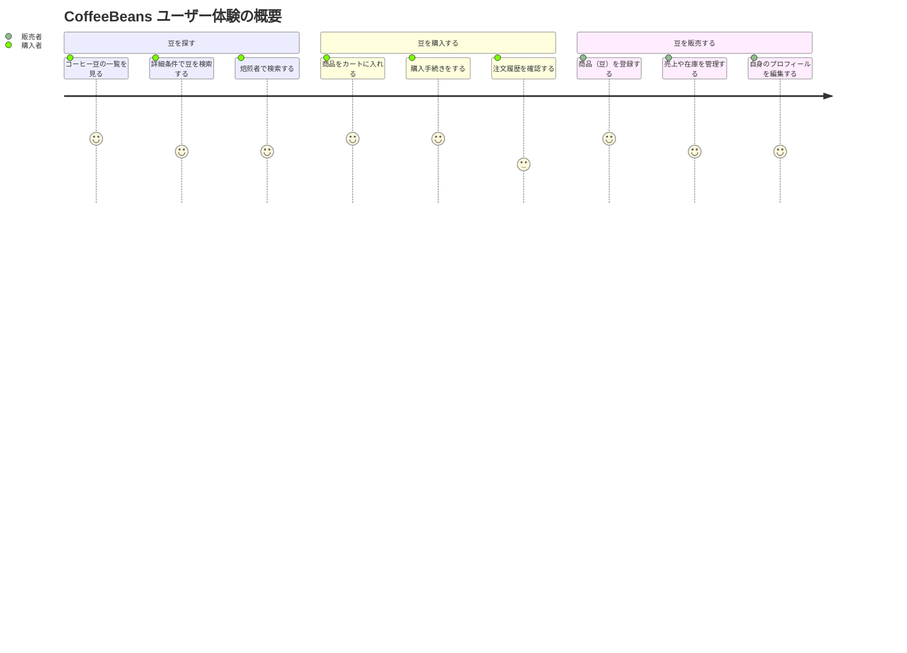

# CoffeeBeans - コーヒー豆フリマサービス ☕

自家焙煎のコーヒー豆を、誰もが手軽に、そして安心して売買できる CtoC（個人間取引）マーケットプレイスです。

## 🎯 プロジェクトの目的 (Vision)

「もっと気軽に、もっと安く、美味しい自家焙煎のコーヒー豆を楽しみたい」という想いからこのプロジェクトは生まれました。

従来のマーケットでは送料が高かったり、複数の焙煎所の豆を一度に比較検討することが困難でした。`CoffeeBeans`は、自家焙煎を行う情熱的な焙煎者と、最高のコーヒー体験を求めるユーザーを直接繋ぎ、公正な価格（低い手数料）で高品質なコーヒー豆が流通する活気あるコミュニティを創造することを目指します。

## 🗺️ ユーザー体験 (User Journey)

このサービスが提供する主要なユーザー体験は以下の通りです。



## ✨ 主な機能 (Features)

- **コーヒー豆の売買機能**: CtoC での安全な取引を実現します。
- **高度な検索機能**: 豆の産地、焙煎度、精製方法、農園などの詳細な条件で豆を絞り込めます。
- **焙煎者評価システム**: 商品だけでなく「人（焙煎の腕前）」を評価する独自の仕組みを導入します。
- **販売者向けダッシュボード**: 焙煎者が売上や在庫を直感的に管理できる機能を提供します。
- **イベント企画**: 「お題豆」のような、コミュニティが一体となって楽しめるイベントを企画します。

## 🛠️ 技術スタック (Tech Stack)

| カテゴリ           | 技術                                  |
| :----------------- | :------------------------------------ |
| **フロントエンド** | React, TypeScript, Vite, Tailwind CSS |
| **バックエンド**   | Go (Golang)                           |
| **データベース**   | Supabase                              |
| **決済**           | Stripe                                |
| **開発環境**       | Docker, VS Code Dev Containers        |

## 🚀 開発環境の構築 (Getting Started)

Docker と Dev Containers を利用することで、OS を問わず誰でも同じ開発環境を即座に構築できます。

### 1. 事前準備 (Prerequisites)

開発を始める前に、お使いの PC に以下のツールをインストールしてください。

- **Git**: ソースコードのバージョン管理に必須です。
- **Docker Desktop**: コンテナ開発のエンジンです。
- **Visual Studio Code**: メインのエディタとして使用します。
- **[Dev Containers 拡張機能](https://marketplace.visualstudio.com/items?itemName=ms-vscode-remote.remote-containers)**: VS Code でコンテナ開発を行うための拡張機能です。

> **Windows ユーザーの方へ**: パフォーマンスと互換性の問題を防ぐため、プロジェクトは必ず**WSL2 のファイルシステム内**にクローンしてください。（例: `\\wsl.localhost\Ubuntu\home\<ユーザー名>\CoffeeBeans`）

### 2. セットアップ手順 (Setup)

1.  **リポジトリをクローン**

    ```bash
    git clone https://github.com/JacuCoffeeBeans/CoffeeBeans.git
    cd CoffeeBeans
    ```

2.  **環境変数の設定**
    `.env.example`をコピーして`.env`ファイルを作成します。API キーなどの秘匿情報はこのファイルで管理します。

    ```bash
    cp .env.example .env
    ```

    作成した`.env`ファイルに、Supabase や Stripe から取得したキーを追記してください。

3.  **Dev Container で起動**
    VS Code でプロジェクトフォルダを開くと、右下に **"Reopen in Container"** という通知が表示されます。このボタンをクリックしてください。
    初回起動時は開発用の Docker イメージがビルドされるため、数分かかります。

### 3. アプリケーションの実行 (Running the App)

コンテナ起動後、VS Code のターミナルはフロントエンド用に設定されています。バックエンドは別途ターミナルを起動する必要があります。

1.  **フロントエンド (React)**
    VS Code のターミナル（`Terminal > New Terminal`）で、以下のコマンドを実行します。

    ```bash
    # /workspaces/coffeebeans/frontend ディレクトリにいることを確認
    npm install # 初回のみ
    npm run dev
    ```

    → ブラウザで `http://localhost:5173` を開くと画面が表示されます。

2.  **バックエンド (Go)**
    **新しいローカルターミナル**（WSL のターミナルなど）を開き、以下のコマンドでバックエンドコンテナに入ってサーバーを起動します。

    ```bash
    # ホストOSのターミナルから実行
    docker compose exec backend sh

    # --- コンテナ内での操作 ---
    go mod tidy # 初回のみ
    air         # ホットリロードを有効にしてサーバーを起動
    ```

    → `http://localhost:8080` で API サーバーが起動します。

    **2 回目以降**

    ```bash
    docker compose exec backend sh -c "air"
    ```

## API

バックエンドは Go で実装された REST API サーバーです。
主要なエンドポイントの定義は `backend/handlers.go` に記載されています。

## 📁 ディレクトリ構成 (Directory Structure)

```
CoffeeBeans/
├── .devcontainer/      # Dev Container（コンテナ開発環境）の設定
├── .github/            # GitHub Actions (CI/CD) の設定
├── backend/            # GoによるバックエンドAPI
├── docs/               # プロジェクト関連ドキュメント
│   └── adr/            # アーキテクチャ決定記録 (Architecture Decision Record)
├── frontend/           # Reactによるフロントエンド
├── .env.example        # 環境変数のテンプレート
├── docker-compose.yml  # 開発環境のコンテナ構成
└── README.md           # あなたが今見ているファイル
```
