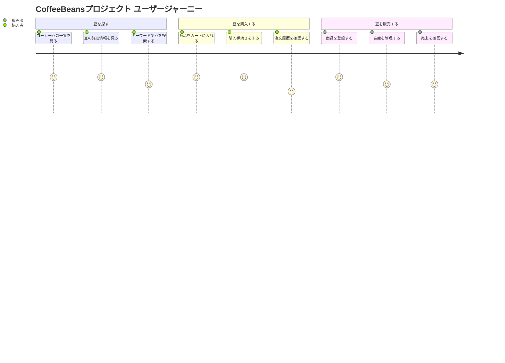

## 🗺️ ユーザーストーリーマップ

このサービスの主要なユーザーストーリーと、ユーザーの体験（ジャーニー）を可視化します。
バックボーン（横軸）にユーザーの大きな目的を、その下に具体的なストーリー（縦軸）を配置しています。

### この図の見方

* **登場人物 (Actor)**
    * `購入者`: 購入者側のユーザー
    * `販売者`: 販売者側のユーザー

* **大まかな行動 (Section)**
    * ユーザーがこのサービスで行うであろう、大きな行動の括りです。

* **具体的なユーザーストーリー (Task)**
    * それぞれの行動の中で、ユーザーが「やりたいこと」を具体的に記述したものです。
