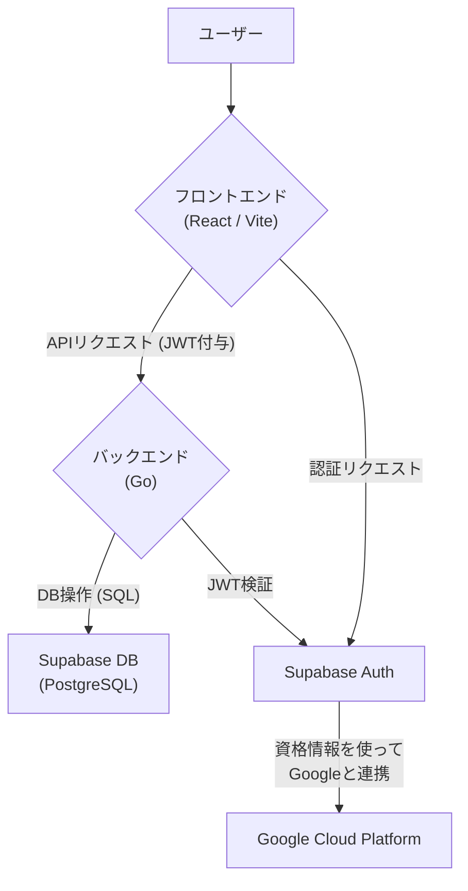

# アーキテクチャ概要図

フロントエンド、バックエンド、Supabase、GCP がどのように連携しているかを示します。

```mermaid
graph TD
    %% --- ノード定義 ---
    A[ユーザー]
    B{"フロントエンド<br>(React / Vite)"}
    C{"バックエンド<br>(Go)"}
    D["Supabase DB<br>(PostgreSQL)"]
    E[Supabase Auth]
    F[Google Cloud Platform]

    %% --- 連携フロー ---
    A --> B
    B --> |"APIリクエスト (JWT付与)"| C
    B --> |"認証リクエスト"| E
    C --> |"DB操作 (SQL)"| D
    C --> |"JWT検証"| E
    E --> |"資格情報を使って<br>Googleと連携"| F
```
